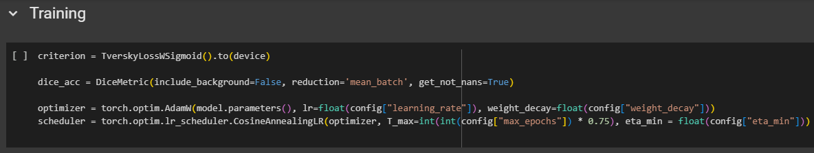

# Ứng dụng Deep Learning cho Phân đoạn Khối u Gan trên Ảnh CT 3D

Báo cáo khóa luận này trình bày về việc xây dựng hệ thống tự động phân đoạn gan và khối u gan từ ảnh CT 3D bằng các kỹ thuật học sâu. Mô hình sử dụng chiến lược Coarse-to-Fine với hai giai đoạn: giai đoạn phân đoạn gan và giai đoạn phân đoạn khối u trong vùng ROI gan.

---

## Mục lục

- [Ứng dụng Deep Learning cho Phân đoạn Khối u Gan trên Ảnh CT 3D](#ứng-dụng-deep-learning-cho-phân-đoạn-khối-u-gan-trên-ảnh-ct-3d)
  - [Mục lục](#️mục-lục)
  - [1. Giới thiệu đề tài](#1-giới-thiệu-đề-tài)
  - [2. Hệ thống \& Môi trường](#2-hệ-thống--môi-trường)
  - [3. Cấu trúc thư mục](#3-cấu-trúc-thư-mục)
  - [4. Xử lý dữ liệu](#4-xử-lý-dữ-liệu)
  - [5. Kiến trúc mô hình](#5-kiến-trúc-mô-hình)
  - [6. Huấn luyện \& Đánh giá](#6-huấn-luyện--đánh-giá)
  - [7. Cách chạy mô hình](#7-cách-chạy-mô-hình)
  - [8. Hạn chế \& Hướng mở rộng](#8-hạn-chế--hướng-mở-rộng)

---

## 1. Giới thiệu đề tài

* Phân đoạn gan và khối u gan trên ảnh CT 3D.
* Ứng dụng trong hỗ trợ chẩn đoán y tế.
* Sử dụng mô hình Coarse-to-Fine 2 giai đoạn (gan → ROI → khối u).
* Giai đoạn 1 phân đoạn gan trên ảnh CT3D
* Giai đoạn 2 phân đoạn khối u trên vùng ROI được cắt từ ảnh CT3D, ở giai đoạn này sử dụng mô hình 2d, giả định 3 lát cắt làm chiều sâu của ảnh

## 2. Hệ thống & Môi trường

* Yêu cầu hệ thống tối thiểu: Google Colab / GPU T4
* Ngôn ngữ : Python 3.10+, PyTorch 2.x
* Các thư viện liên quan: monai, torchvision, SimpleITK, requests, libtorrent, scikit-learn, medpy, PyYAML, scipy, scikit-image, nibabel

<div style="page-break-before: always;"></div>

## 3. Cấu trúc thư mục

```
project/
├— datasets/
│   ├— get_datasets.py
│   ├— lits.py
│   ├— prepare_data.py
├— init/
│   ├— install_dependencies.py
├— models/
│   ├— layers/
│   ├— ...
├— notebooks/
│   ├— ...
├— processing/
│   ├— augmentation.py
│   ├— postprocessing.py
│   ├— preprocessing.py
├— utils/
│   ├— ...
├— parameters.yaml
└— requirements.txt

```
- <b>Thư mục datasets</b>: gồm các file khai báo custom dataset, file chứa hàm download dataset từ source public
- <b>Thư mục init</b>: gồm file khai báo cài đặt các package cần thiết
- <b>Thư mục models</b>: gồm 2 phần chính, 1 là layers - chủ yếu chứa các block/module đơn vị nhỏ nhất có thể cấu thành model, 2 là các file chứa các custom model, các file model này sử dụng các block/module từ file layers
- <b>Thư mục notebooks</b>: Chứa các file notebooks, dùng để triển khai huấn luyện model, visualize kết quả...
- <b>Thư mục processing</b>: gồm 3 file, lần lượt là preprocessing - tiền xử lý, augmentation - tăng cường ảnh, postprocessing - hậu xử lý
- <b>Thư mục utils</b>: chứa các file/hàm chức năng hỗ trợ quá trình huấn luyện model
- <b>File parameters.yml</b>: chứa các siêu tham số, các path được khai báo mặc định 
- <b>File requirements.txt</b>: chứa các package cần thiết trong quá trình huấn luyện, được gọi từ file trong thư mục init để cài đặt

## 4. Xử lý dữ liệu

* Dữ liệu: LiTS17 - https://www.sciencedirect.com/science/article/pii/S1361841522003085
* Giai đoạn 1: phân đoạn gan
    * Tiền xử lý: (chỉnh sửa file processing/preprocessing.py)
        * clip HU (hounsfield unit): -200:250
        * Normalize: zscore
        * resize: 128x128x128
    * Tăng cường dữ liệu: (chỉnh sửa file processing/augmentation.py)
        * random flip
        * random zoom
        * random rotate, scale
        * random shift intensity
        * random gaussian noise
        * random bias field
* Giai đoạn 2: phân đoạn u gan
    * Tiền xử lý: (chỉnh sửa file processing/preprocessing.py)
        * clip HU (hounsfield unit): 0:200
        * Normalize: zscore
        * resize: 3x256x256
    * Tăng cường dữ liệu: (chỉnh sửa file processing/augmentation.py)
        * random flip
        * random zoom
        * random rotate
        * random shift intensity
        * random gaussian noise
        * random bias field
* Cân bằng dữ liệu cho giai đoạn 2:
    * Tổng quan số lượng mẫu ở giai đoạn 2, sau khi cắt ảnh thành 3 slide với bước nhảy 2
        
        * Từ table trên ta có nhận xét là dữ liệu khối u chỉ chiếm ~13%, điều này dẫn đến việc dữ liệu cần phải được cân bằng trước khi huấn luyện nếu không kết quả sẽ bị lệch
    * Cân bằng dữ liệu (chỉ thực hiện trên tập huấn luyện):
        * undersampling - giảm mẫu:
            - Cách làm của bước này sẽ là lấy tổng số mẫu - (mẫu gan + mẫu u), sau khi ra được mẫu nền, mình chỉ lấy khoảng 30 - 40% số mẫu nền để kéo độ cân bằng về với gan và u, tránh bị lệch quá mức về nền
        * Weighted Sampling - Lấy mẫu có trọng số:
            - Thêm 1 cách nữa để tăng sự cân bằng cho dữ liệu là gán trọng số cao hơn (5) cho các mẫu có khối u, ngược lại thì các mẫu còn lại đều là (1)


## 5. Kiến trúc mô hình

* Mô hình chung: UNet + feature extraction block (ResNeXt +  Multi-Scale Convolution + CoTAttention)
    - Mô hình tổng quát (lấy mô hình 3d làm ví dụ)    
        - Unet
            
        - Khối trích xuất đặc trưng
            
        - Khối tích chập đa tỉ lệ
            
        - Khối attention
            
    - Giai đoạn 1: Sử dụng mô hình 3d
    - Giai đoạn 2: Sử dụng mô hình 2d
* Nhận xét thêm từ việc tune activation
    - Các block như ResNeXt, CNN khi kết hợp với Unet ở các papers gốc tác giả thường dùng ReLU làm activation chính, tuy nhiên khi mở rộng sang bài toán sử dụng ảnh CT, giá trị của ảnh CT có thể giao động từ -1000:1000. Khi tensor đầu vào qua lớp tích chập đầu tiên, nếu có sử dụng hàm ReLU thì các giá trị âm sẽ bị mất hết, điều này làm mất thông tin dữ liệu quan trọng.
    - Trong đề tài trên có sử dụng SiLU làm activation thay thế cho ReLU ở các layer cnn <br/>
        
    - Có thể sử dụng các activation khác có tính "mềm" với biên âm như Leaky ReLU, PReLU, ELU, SELU, GELU, SiLU

## 6. Huấn luyện & Đánh giá

* Loss: (chỉnh sửa file utils/metrics.py)
    * Giai đoạn 1:
        - Dice Loss + BCE, tỉ lệ 7/3
    * Giai đoạn 2:
        - Tversky Loss (alpha: 0.7, beta: 0.3) + BCE, tỉ lệ 7/3
* Metrics: Dice, IoU, Precision, Recall (chỉnh sửa file utils/metrics.py)
* Learning Rate: 1e-3
* Optimizer: AdamW; Weight Decay: 1e-5
* LR Scheduler: CosineAnnealingLR; eta_min: 1e-5

## 7. Cách chạy mô hình
* Giai đoạn 1:  
    - Có 3 file notebooks: liver, liver_1, liver_2
    - File có chia các section con tương ứng với từng step: 
        - Khai báo, cài package và tải dataset (Ở bước này trên Colab sẽ bị lỗi phiên bản của numpy, cần restart session và run lại ở bước import package)
        - load dataset
            
        - Visualize sample (option)
        - Training và đánh giá hiệu suất model + lưu weight vào google drive
            
            
        - Sau khi train xong thì lưu kết quả train vào trong file json để tiện tracking và đánh giá về sau
            
        - Visualize kết quả mẫu từ weight đã lưu ở trên với tập test
        - Plot chart kết quả train từ file json ở trên (optional)
* Giai đoạn 2:
    - Có 2 file notebooks: tumor, tumor_1
    - File có chia các section con tương ứng với từng step sau:
        - Khai báo, cài package và tải dataset (Ở bước này trên Colab sẽ bị lỗi phiên bản của numpy, cần restart session và run lại ở bước import package)
        - Load model với weight của giai đoạn 1, khai báo model cho giai đoạn 2
            
        - dùng model 1 dự đoán 1 lượt toàn bộ dataset để lấy bounding box vùng gan của từng ảnh CT rồi lưu lại, sử dụng bounding box trên, loop toàn bộ ảnh CT và cắt theo bounding box đó, cuối cùng chuyển ảnh CT3D thành ảnh 2D hoặc 2.5D giả định nhiều lát cắt thành chiều sâu của ảnh => tạo thành dữ liệu 2D mới
            
            
        - Load dataset mới
            
        - Rebalancing train dataset (undersampling + weighted sampling)
            
            
        - Training và đánh giá hiệu suất model + lưu weight vào google drive
            
            
        - Sau khi train xong thì lưu kết quả train vào trong file json để tiện tracking và đánh giá về sau
            
        - Visualize kết quả mẫu từ weight đã lưu ở trên với tập test
        - Plot chart kết quả train từ file json ở trên (optional)


## 8. Hạn chế & Hướng mở rộng

* Chưa đánh giá cross-dataset
* Chưa áp dụng mô hình SOTA mạnh cho bài toán segmentation (vd như InternImage), có thể áp dụng các khối attention mechanism tối ưu hơn
